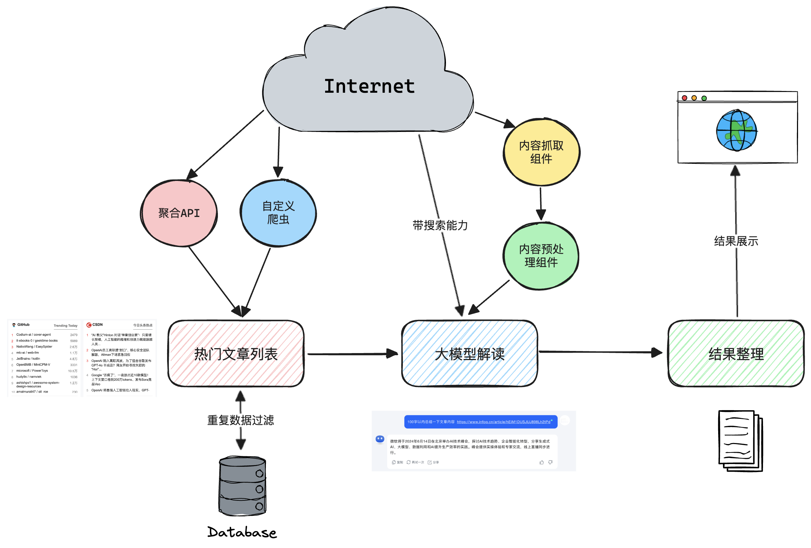

# developer-hotspots-summary
> 自动汇总并解读热榜内容。通过抓取技术热榜列表数据，并将相关文章内容发送给大模型生成摘要。

## 背景
- 不知道从哪里去获取技术热点信息？
- 工作繁忙没时间了解新知识和技术趋势？
- 近期热点事件老是错过？
- 硬核文章太难或内容太长，没时间深入学习？

## 方案设计 


PS：目前项目暂时没有实现“重复数据过滤”、“自定义爬虫”和“内容预处理”（可以基于LangChain实现）功能，后续会逐步完善。

## 依赖三方API
- [Tophubdata](https://www.tophubdata.com/): 提供热门榜单数据，现成数据不用自己写爬虫（有一定费用开销）；
- [Moonshot AI](https://platform.moonshot.cn/): 大模型KIMI的API，不支持搜索能力。

## 使用方式
- 将config-template.yaml重命名为config.yaml，按照诉求修改中配置项（添加开放api的key值, 并按照自己需求调整热榜类型）
- 运行main.py程序
```
python3 main.py
```
- 在/result文件下获取生成后文档    
--- 
历史生成结果查看: 
- [2024-05-28热门文章](./result/2024-05-28热门文章.md)
- [2024-06-03热门文章](./result/2024-06-03热门文章.md)
- [2024-06-07热门文章](./result/2024-06-07热门文章.md)

License
---

This code is distributed under the MIT license. See `LICENSE` in this directory.